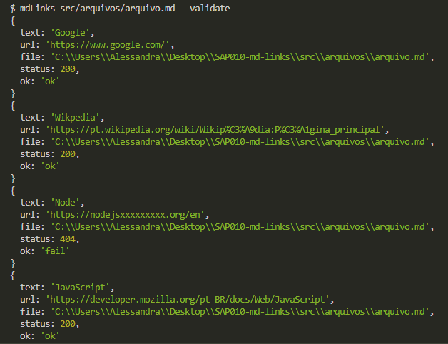
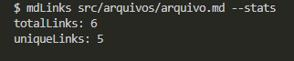
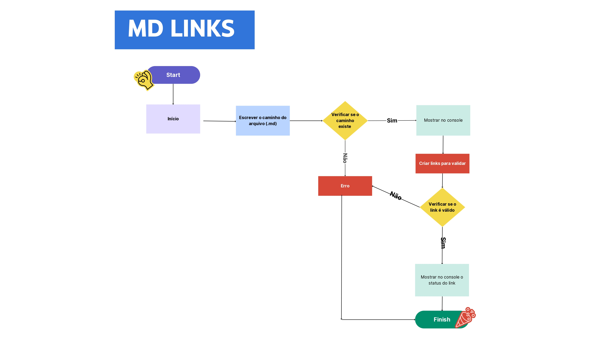

# Markdown Links

## Índice

* [1. Prefácio](#1-prefácio)
* [2. Guia para instalção e uso](#2-Guia-para-instalção-e-uso)
* [3. Fluxograma](#3-Fluxograma)
* [4. Tecnologias utilizadas](#4-Tecnologias-utilizadas)

***

## 1. Prefácio

Markdown é uma linguagem de marcação amplamente adotada por programadores, sendo utilizada em diversas plataformas para formatação de texto, como o GitHub, fóruns e blogs. Arquivos nesse formato são ubíquos, destacando-se o icônico README.md encontrado em praticamente todos os repositórios.

Este projeto visa a criação de uma biblioteca que permita a análise de arquivos Markdown por meio de uma Interface de Linha de Comando (CLI). Através de um módulo Node.js, a biblioteca será executada no terminal e realizará a leitura de arquivos com extensão Markdown (.md). Essa análise englobará a identificação de links contidos nos arquivos, bem como a extração de estatísticas relevantes.
## 2. Guia para instalção e uso: 

Instale a biblioteca no terminal através do comando: npm install alessandraalveslopes-mdlinks

Após a instalação, certifique de ter um arquivo .md com links dentro.

  1- Rode o comando mdlinks + o caminho do seu arquivo , e será retornado o caminho, text e o link do arquivo seleciondao. Veja o exemplo abaixo:

  

  2- Se você deseja validar os links desse arquivo, utilize a propriedade --validade, esta fará uma requisição HTTP e retornará o status e ok do seu link.
Comando:
md-links <caminho-do-arquivo> --validate.
Veja o exemplo abaixo:

  

  3- Se você deseja verificar as estatistiscas dos links desse arquivo, utilize a propriedade --stats, esta retornará o total de links encontrados no arquivo e quais desses são unicos.
Comando:
md-links <caminho-do-arquivo> --stats.
Veja o exemplo abaixo:

  

  4- Se você deseja verificar as estatistiscas e validar os links desse arquivo, utilize a propriedade --validade --stats, esta retornará o total de links encontrados no arquivo, quais desses são unicos e quais estão quebrados.
Comando:
md-links <caminho-do-arquivo> --validate --stats.
Veja o exemplo abaixo:

## 3. Fluxograma:

## 4. Tecnologias utilizadas:

     